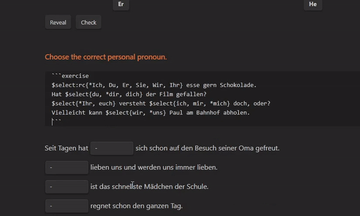
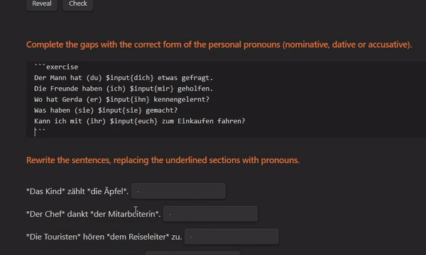
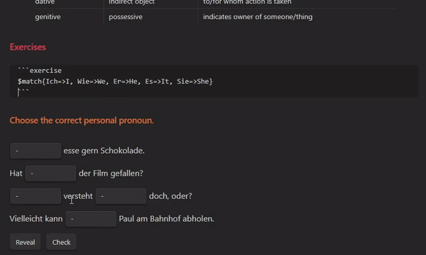
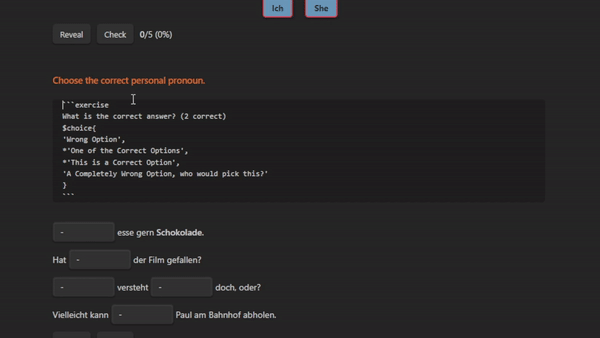

# Obsidian Exercises

Obsidian Exercises was developed as an easy way to create exercises within Obsidian. Whether you are preparing for exams, learning a language, refreshing your memory, or any other purpose, you can now create them alongside your notes.

This plugin uses a block component as a base. Within it, you can define normal text and the exercise element below. Example:

> \```exercise
> <br/>$match{Ich=>I, Wie=>We, Er=>He, Es=>It, Sie=>She}
> <br/>\```

## Select



**Note:** The Options Menu is not showing in the image above.

>$select{"option1", "option2" [, …]}

Select an option from a drop list. Options are separated by commas, but consider always using quotations. For multi word values (that contain spaces) they are necessary. Options are **randomized** before being displayed.

To define a **correct option** you can simply prepend the option with an asterisk (for example: \*"option").

Example — $select{"option1", \*"option2", "option3", "option4"}

In the example above, there are 4 options and option 2 is the correct one.

You can define **multiple correct options** and they will all be evaluated. When revealing options, the first in the list will be the one shown.

## Input



>$input{"option1", "option2" [, …]}

Input Text into a textbox. The options are evaluated as they are written. You can write **one or more options**, they will all be evaluated, but only the first is shown on reveal.

Example — $input("Correct Text.")

In the example above the correct input is "Correct Text.".

## Line

>$line{"option1", "option2" [, …]}

Line is a wider version of input.

## Match



>$match{"option1"=>"value1", "option2"=>"value2" [, …]}

Match values from two columns. The matches are defined with "=>" and separated by commas. These values will be **randomized** before being displayed.

## Choice



>$choice{"option1", *"option2" [, …]}

Choose one or more options from the multiple choice box. Options are separated by commas, but consider always using quotations. They are required for multi-word values (containing spaces). Options are **randomized** before being displayed.

To define a **correct option** you can simply prepend the option with an asterisk (for example: \*"option").

Example — $choice{"option1", \*"option2", "option3", \*"option4"}

In the example above, there are 4 options, option 2 and option 4 are correct. All correct options and no incorrect options must be selected for the answer to be considered correct.

# Thanks

[@Raboro](https://github.com/Raboro) for fixing some typos

# Support

<a href='https://ko-fi.com/alexccavaco' target='_blank'></a>
